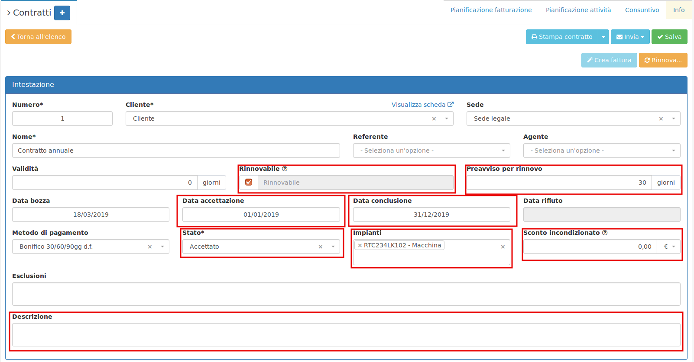

# Assistenza tecnica

### Contratti di manutenzione


Come creo dei contratti di manutenzione su impianti,dispositivi o macchine?


Per creare un contratto di manutenzione su impianti,dispositivi o macchine la prima cosa da fare è creare uno o più **impianti**. [Cliccare qui](../guide/modules/impianti/) per la guida di creazione di un impianto\(vedere anche **Creazione** e **Modifica**\).

Per registrare un **contratto** di manutenzione su quei determinati impianti creo un **contratto**, specificando però determinati campi, di seguito spiegati. [Cliccare qui ](../guide/modules/vendite/contratti/)per la guida di creazione di un contratto\(vedere anche **Creazione** e **Modifica**\).

Lo screenshot soprastante appare quando si va a creare un contratto, importante, però, è fare attenzione ai campi segnati in rosso:

* **Rinnovabile:** Spunto il campo se il contratto è rinnovabile.
* **Preavviso per rinnovo:** In questo campo si indicano i giorni di preavviso per il rinnovo del contratto. Quindi, in base a quanti giorni ho indicato il **Preavviso per** **rinnovo** mi appariranno nel modulo **Dashboard** nel _widget_ **Contratti in scadenza** il numero di contratti che stanno per scadere. Per esempio se ho specificato il **Preavviso** di 90 giorni, il 90esimo giorno dalla data del rinnovo quel contratto mi apparirà nel widget **Contratti in scadenza.**

* **Data accettazione:** Specificare la data di inizio del contratto.
* **Data conclusione:** Specificare la data di fine del contratto.
* **Stato:** Specificare lo stato del contratto, ad esempio: accettato,bozza,in attesa di conferma ...
* **Impianti:** Specificare su quali **impianti** vado a lavorare. Se il contratto prevede una manutenzione su più macchine è necessario registrare in **Myimpianti** ogni macchina e successivamente aggiungerle manualmente in **Contratti** sul campo **Impianti**.
* **Sconto incondizionato:** Specificare un eventuale sconto in € o %
* **Descrizione:** Specifico un eventuale descrizione interna, ad esempio il lavoro eseguito.

Sotto alla sezione **intestazione** è presente la sezione **Costi unitari** nella quale posso andare a specificare eventuali costi:

* Costo orario
* Costo al km 
* Diritto di chiamata
* Costo orario\(tecnico\)
* Costo al km\(tecnico\)
* Diritto di chiamata\(tecnico\)

Se nel **contratto** sono inclusi i costi specificati sopra in **Costi unitari** è possible mettere tutti i campi a **0.**

Se si vuole creare un proprio **Tipo attività** lo si può fare in [**Attività**](../guide/modules/attivita/) ****su [**Tipi di attività**](../guide/modules/attivita/tipidiattivita/)**.** In questo modo il **tipo di attività** verrà visualizzato nella sezione **Costi unitari**.

Sotto alla sezione **Costi unitari** è presente la sezione **Righe** nella quale posso andare ad aggiungere:

* **Articolo**
* **Riga**
* **Descrizione**

