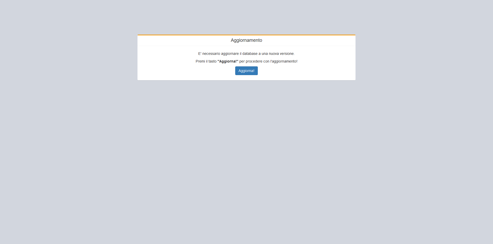
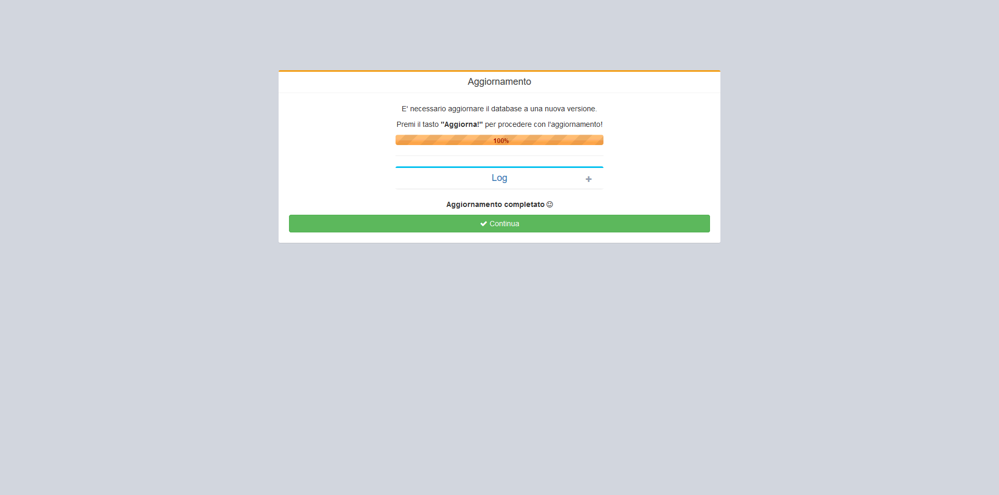
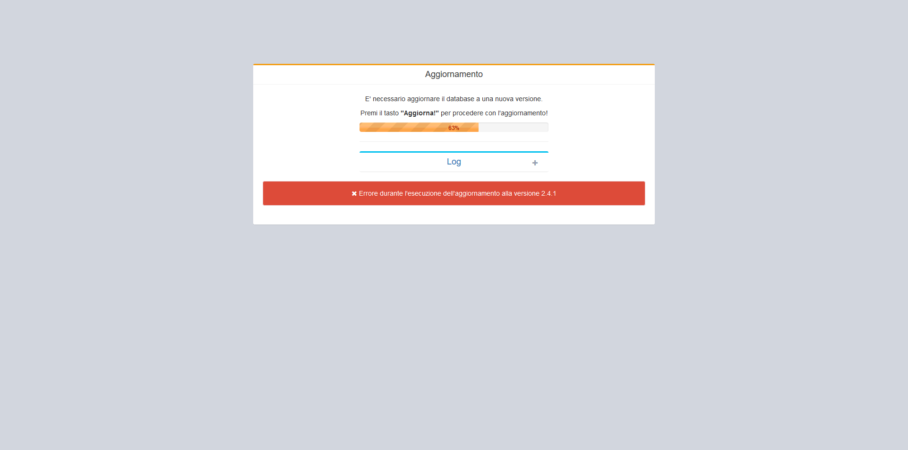
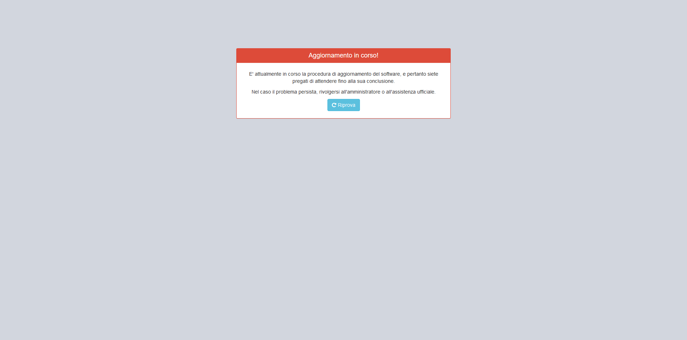

# Aggiornamento

OpenSTAManager supporta due procedure distinte per il caricamento degli aggiornamenti:

* Automatici tramite caricamento del file ZIP nel modulo Aggiornamenti
* Manuali tramite la scompattazione del file ZIP

Per un approfondimento su entrambe queste tipologie, siete pregati di visitare la sezione [Aggiornamenti della documentazione tecnica](../../docs/docs-1/aggiornamento.md).

Dopo il caricamento dell'aggiornamento, si possono in genere verificare due situazioni:

* L'aggiornamento **non** richiede di modificare il database, e quindi non sono necessarie ulteriori azioni
* L'aggiornamento richiede di modificare il database

In quest'ultimo caso, ogni utente presente all'interno del gestionale verrà automaticamente reindirizzato verso il logout e sarà possibile aggiornare il database come richiesto attraverso delle apposite schermate e il pulsante  .

## Errori di aggiornamento

La procedura di aggiornamento, come ogni componente software, è soggetta a possibili errori.

Nel caso questi si verifichino, l'utente dovrebbe riuscire a visualizzare il seguente messaggio informativo:

In questi casi, si consiglia di contattare gli sviluppatori ufficiali e di consultare il [forum ufficiale](https://www.openstamanager.com/forum/) per eventuali segnalazioni simili.

## Aggiornamento in corso


Mentre l'aggiornamento è in esecuzione, il gestionale rimarrà bloccato per tutti gli utenti ad eccezione di quello responsabile dell'inizio della procedura di aggiornamento.

Nel caso la procedura rimanga persistente per un periodo molto prolungato di tempo, è possibile che si sia verificato un errore non rilevato dall'utente durante l'aggiornamento. In questo caso si consiglia di consultare la sezione di [Ripresa forzata](aggiornamento.md#ripresa-forzata) oppure di contattare gli sviluppatori ufficiali.


## Ripresa forzata

In alcuni casi particolari, può essere necessario riprendere forzatamente l'esecuzione di un aggiornamento andato in errore.

Questo viene reso possibile visitando l'URL a cui è possibile accedere a OpenSTAManager con l'aggiunta del testo `?force`.


**Attenzione**: quest'azione è sconsigliata a utenti non esperti.


