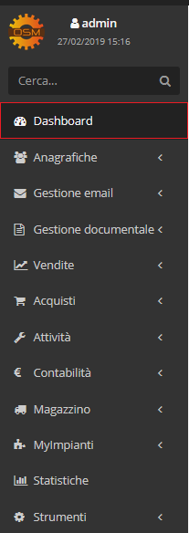

# Dashboard

**Dashboard** è il primo modulo presente in OpenSTAManager, grazie al calendario, offre una visione generale degli interventi e attraverso l'applicazione dei filtri è possibile ridurre il campo di ricerca per uno sguardo più approfondito su determinate operazioni. 

Attraverso il calendario è inoltre possibile creare un intervento, [clicca qui](creazione.md#da-calendario) per aprire la pagina di **creazione** di un intervento.

L' utente ha a disposizione delle strutture, chiamate _widget,_ che permettono di visualizzare:

* Promemoria contratti da pianificare
* Promemoria attività da pianificare
* Ordini di servizio da impostare
* Scadenze
* Articoli in esaurimento
* Preventivi in lavorazione
* Contratti in scadenza
* Rate contrattuali
* Stampa calendario

Un _widget_ molto utile è **Stampa calendario** , cliccando su di esso, specificando _anno_ e _mese,_ è possibile avere una stampa del calendario.

### Navigazione

Il modulo è raggiungibile attraverso il menu laterale del gestionale, sotto il link **Dashboard**

### Caratteristiche

L' interfaccia della **Dashboard** è personalizzabile rimuovendo o aggiungendo _widget_ a piacimento.

Cliccando su un intervento nel calendario è possibile accedere alla schermata di modifica:                                                                  

**Esempio rimozione widget**

Se un _widget_ è stato rimosso è possibile aggiungerlo tramite il modulo **Strumenti**, cliccando il modulo **Aggiornamenti** selezionando l'ingranaggio del _widget_ che si desidera aggiungere.

Dal modulo **Strumenti** è anche possibile disattivare un _widget_ attivo, selezionando l'ingranaggio del _widget_ che si desidera aggiungere.

Per maggiori approfondimenti andare sul modulo [Aggiornamenti](../strumenti/aggiornamenti.md).

