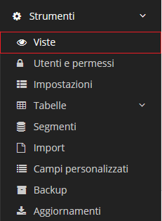
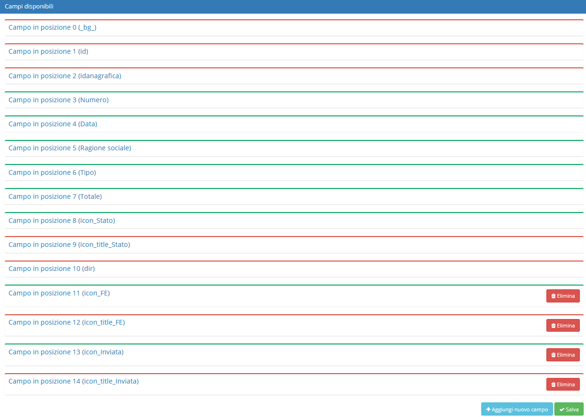
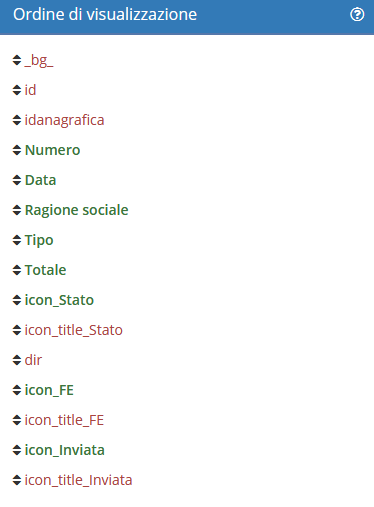

# Viste

Il modulo **Viste** permette di apportare delle modifiche ai _campi_ dei moduli.

### Navigazione

Il modulo è raggiungibile attraverso il menu laterale del gestionale, sotto il link **Strumenti**

### Modifica

La sezione di modifica degli elementi del modulo segue il sistema standard del gestionale, necessitando il click sulla riga relativa al _record_ all'interno della tabella della schermata principale.

Una volta entrati in questa parte del sistema si può procedere al completamento e alla modifica del _record._ 

La schermata di modifica è divisa in:

* Opzioni di visualizzazione
* Campi disponibili
* Ordine di visualizzazione
* Filtro per gruppo di utenti 

Grazie a **Opzioni di visualizzazione** è possibile modificare diversi campi, quali:

* Nome del modulo\(Modificare il nome che identifica il modulo\)
* Query personalizzata\(Scrivere una query in sostituzione a quella di default\)

Grazie a **Campi disponibili** è possibile cambiare:

* Gruppi con accesso \(gruppi e utenti in grado di visualizzare quel campo\)
* Visibilità\(stato del campo, visualizzabile oppure nascosto \)

Cliccando sopra un _record_ sono presenti 4 campi selezionabili:

* Ricercabile\(indica se il campo è ricercabile\)
* Ricerca lenta\(selezionabile per indicare se la ricerca di quel campo è lenta\)
* Sommabile\(se il campo è da sommare\)
* Formattabile\(se il campo si può formattare\(data,ora,anno,..\)\)

Grazie a **Ordine di visualizzazione** posso cambiare l'ordine dei campi trascinando il campo.

Grazie a **Filtri per gruppo di utenti** posso decidere cosa mostrare ad un determinato utente.

**Esempio**: _Mostra ai clienti solo le proprie fatture_, se abilitato i clienti visualizzeranno solo le proprie fatture, se non è abilitato il cliente è abilitato a vedere le fatture anche degli altri clienti

