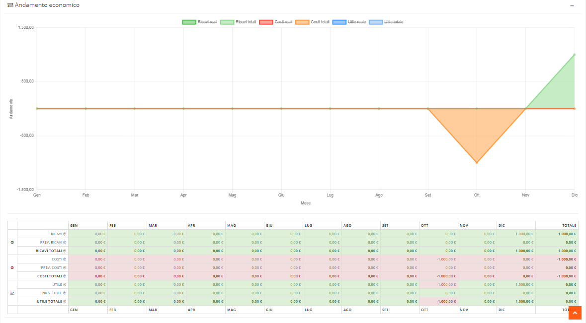
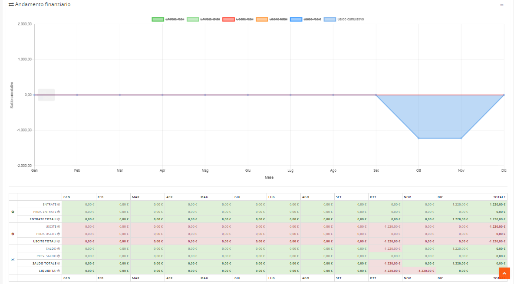
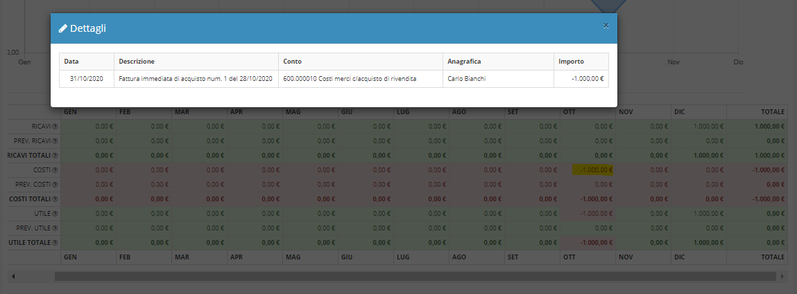

# Budget

**Budget** è uno dei diversi moduli acquistabili da **OpenstaSTAManager.** Il modulo budget permette di visualizzare sotto-forma di grafico e tabella l'**andamento economico** \(costi/ricavi\) e l'**andamento finanziario** \(entrate/uscite\). Oltre all'andamento reale, permette di integrare anche le **previsioni di costi e ricavi**, e delle **entrate** e **uscite**. 


[Clicca qui](https://www.openstamanager.com/categoria-prodotto/moduli/) per procedere all'acquisto


### Installazione e aggiornamento

Per maggiori informazioni sulle modalità di installazione e aggiornamento del modulo, consulta la [sezione dedicata](installazione-e-aggiornamento.md).

### Utilizzo

A seguito dell'installazione del modulo, cliccando su **Budget** apparirà alla destra la seguente schermata.

Le **previsioni economiche** sono configurabili dal sotto-menu "Previsionale", da cui è possibile creare delle **previsioni di costi e ricavi**, con la possibilità di selezionare la ricorrenza. 

Le **previsioni finanziarie** funzionano allo stesso modo, basta selezionare l'apposita voce durante l'inserimento.

Oltre al previsionale inserito manualmente dall'utente, c'è la possibilità per utenti avanzati o dal team di OpenSTAManager di configurare delle query SQL che permettano di inserire ulteriori previsioni dai dati presenti in OpenSTAManager, ad esempio la previsione di ricavo di un preventivo o di un ordine. Mentre la previsione di ricavo o di costo avviene per intero e in base ad una specifica data del documento, la previsione di entrata/uscita considera l'importo lordo, ossia ivato, e lo distribuisce in base al tipo di pagamento specificato nel documento o, se mancante, legato all'anagrafica a cui è collegato il documento. Ad esempio, la previsione di fatturazione di un preventivo da 1.000,00 € + iva con pagamento 30/60gg, calcolerà un'entrata prevista di 610,00 € fra 30 giorni e 610,00 € fra 60 giorni.

L'**andamento finanziario**, a differenza di quello **economico**, attinge dati anche dallo scadenzario.

Al click sugli importi mensili è anche possibile visualizzare i dettagli del mese.

